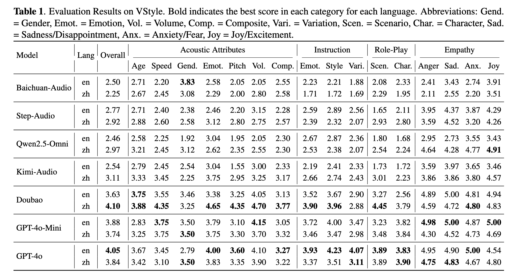

# VoiceGenEval: A Benchmark for Controllable Speech Generation in Spoken Language Models

<div align="center">  <a href="https://junzhan2000.github.io/VoiceGenEval.github.io/">    </a> <a href="https://arxiv.org/abs/2501.00000">    </a> <a href="https://huggingface.co/datasets/zhanjun/VoiceGenEval">    </a>

Comprehensive evaluation of controllable speech generation capabilities in spoken language models, assessing not just what models say, but how they say it.

### Overview

**VoiceGenEval** is a bilingual (Chinese & English) benchmark for **controllable speech generation**. It covers four key tasks:

- Acoustic attribute control
- Natural language instruction following
- Role-playing
- Implicit empathy

To enable automated and reproducible evaluation, we introduce the **LALM-as-a-Judge** framework, which assesses model outputs across three dimensions:

- **Textual faithfulness** (Is it saying the right thing?)
- **Style adherence** (Does it match the intended style?)
- **Naturalness** (Does it sound smooth and natural?)

VoiceGenEval goes beyond checking correctness — it evaluates **how well the model speaks**. Experiments on various open-source and commercial systems show its effectiveness in differentiating the controllable speech generation abilities of different models.


### Leaderboard

- **Evaluation results of different SLMs.**

  We evaluate three proprietary systems [**GPT-4o Audio (snapshot: gpt-4o-audio-preview-2025-06-03)**](https://platform.openai.com/docs/models/gpt-4oaudio-preview), [**GPT-4o-Mini Audio (snapshot: gpt-4o-mini-audio-preview-2024-12-17)**](https://platform.openai.com/docs/models/gpt-4o-mini), and [**Doubao**](https://www.volcengine.com/docs/6561/1594356). Additionally, we include four open-source end-to-end speech language models with strong speech generation performance: [**Step-Audio**](https://github.com/stepfun-ai/Step-Audio), [**Kimi-Audio**](https://github.com/MoonshotAI/Kimi-Audio), [**Baichuan-Audio**](https://github.com/baichuan-inc/Baichuan-Audio), and [**Qwen-2.5 Omni**](https://github.com/QwenLM/Qwen2.5-Omni).



- **Evaluation results of different SLMs across different task types.**

  


### Evaluate your model

We provide a **Gemini API–based evaluation tool** for assessing voice synthesis quality across multiple dimensions. It automatically processes audio samples, generates scores, and produces comprehensive analysis reports.

**Quick Example:**

```bash
# Install dependencies
pip install google-generativeai matplotlib pandas tqdm

# Run evaluation on example data
python lalm_eval/gemini_eval.py \
    --root_dir ./data/examples/model_res/en/wav \
    --metadata_path ./data/examples/model_res/en/metadata.jsonl \
    --out_dir ./data/examples/eval_res/en \
    --gemini_api_key YOUR_API_KEY
```

For detailed usage instructions, see: [lalm_eval/README.md](https://poe.com/chat/lalm_eval/README.md)

### Human-Model Correlation Analysis

We reproduce the correlation study between human annotations and LALM-as-a-Judge as reported in the paper. This validates the reliability of automated evaluation.

**Quick Example:**

```bash
# Download evaluation results of all seven models
huggingface-cli download --repo-type dataset --local-dir-use-symlinks False zhanjun/VoiceGenEval-eval-results --local-dir VoiceGenEval-eval-results

# Compute Spearman correlations
python human_align/compute_model_human_spearman_r.py
```

For detailed analysis instructions, see: [human_align/README.md](https://poe.com/chat/human_align/README.md)

### Contributing

To submit your evaluation results to VoiceGenEval, please send the results file (metadata_with_score.jsonl) to [jzhan24@m.fudan.edu.cn](mailto:jzhan24@m.fudan.edu.cn).

### License

This project is licensed under the MIT License - see the [LICENSE](https://poe.com/chat/LICENSE) file for details.